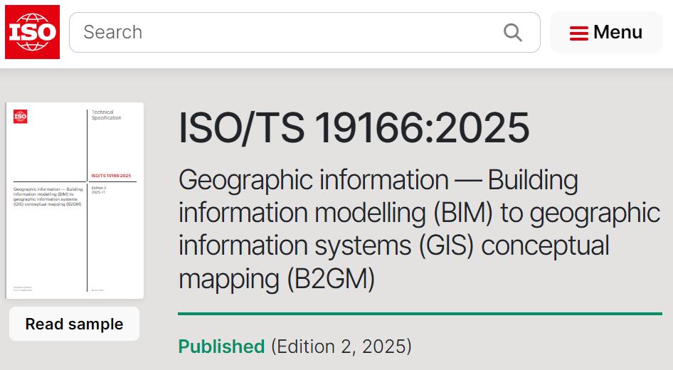
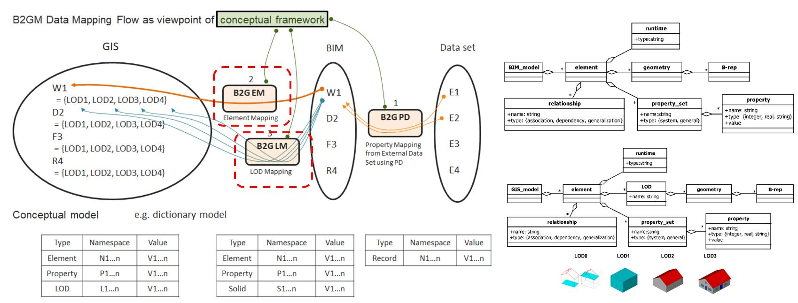
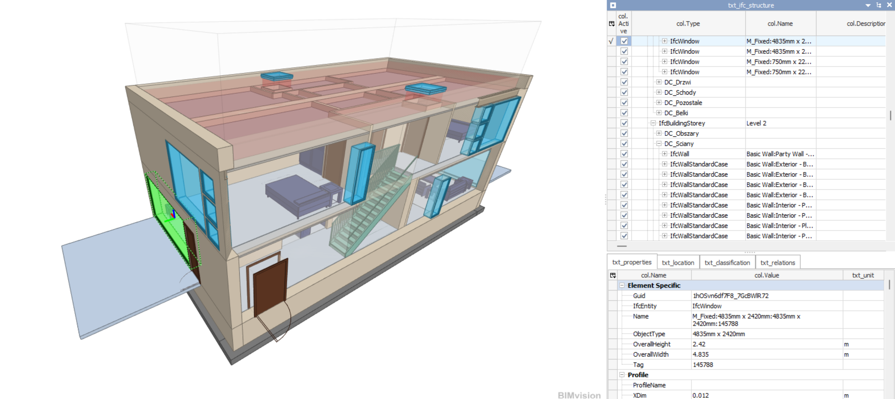
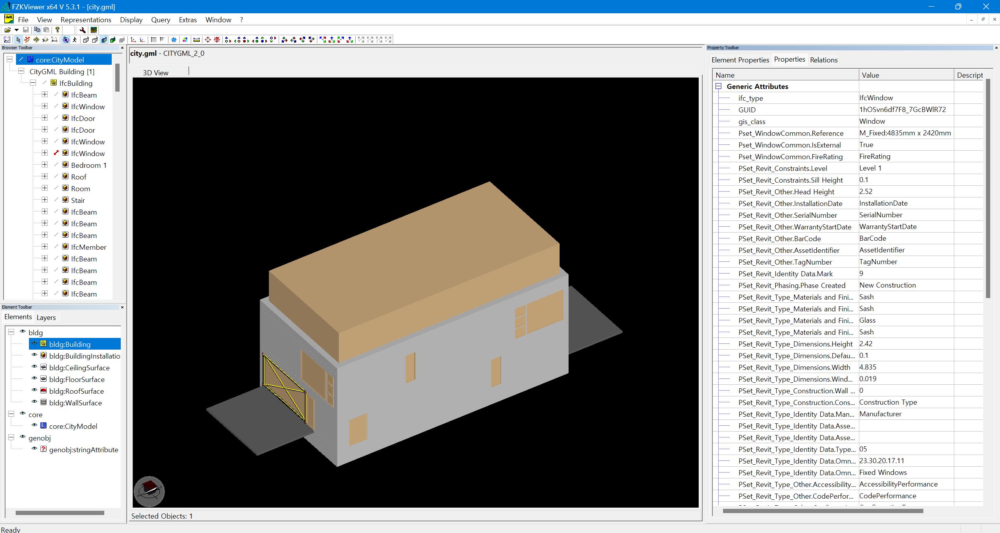
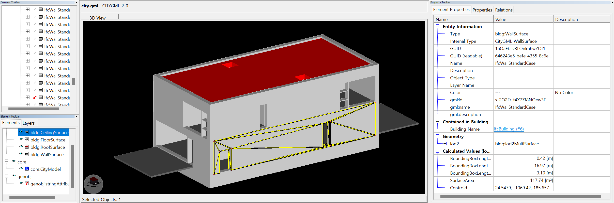
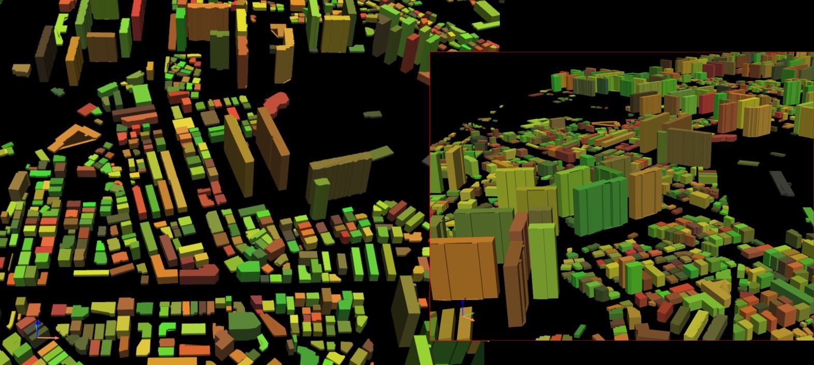

# ISO 19166 B2GM — BIM to GIS conceptual Mapping Tool

An implementation of the [ISO/TS 19166 B2GM](https://www.iso.org/standard/90943.html?__cf_chl_f_tk=kQzk7Sv.wtD0SW3l3_Je9LoXWNXBhLEQEXA6Hk0pKfI-1783160263-1.0.1.1-62DOANOnXh6FQ5oxYhj0y2uqeMqNkTNrxb_9_RSg8tY) conceptual framework: mapping a BIM model (IFC) into a GIS model (CityGML) through four well-defined stages. In fact, I thought there were issues with practical application because standards like ISO often only have standard documents without providing tools. Taking this into consideration, I plan to continue updating it whenever I have time. 

<p align="center">
 </img>
</p>

If you are interested in this project, please fork and join.

```
 IFC (BIM)  ──►  PD  ──►  CM  ──►  EM  ──►  LM  ──►  CityGML (GIS)
                 │        │        │        │
        Perspective  Coordinate  Element    LoD
        Definition   Mapping     Mapping    Mapping
```

| Stage | Name                    | Purpose                                                        |
|-------|-------------------------|----------------------------------------------------------------|
| PD    | Perspective Definition  | Select the required subset of the BIM dataset (data/logic/style views) |
| CM    | Coordinate Mapping      | Transform source CRS → destination CRS (e.g. EPSG:4326 → EPSG:3857) |
| EM    | Element Mapping         | Map an IFC class to its GIS/CityGML class (e.g. `IfcBuilding` → `CityModel.Building`) |
| LM    | LoD Mapping             | Assign a GIS Level-of-Detail (LOD0…LOD4)                        |


<p align="center">
 </img>  </br>
 </img>
 </img>  </br>
 </img> </br>
 </img> 
</p>

## Architecture

| Module                    | Role |
|---------------------------|------|
| `B2GM_model.py`           | Common conceptual data model (`element`, `geometry`, `property_set`, `property`, `relationship`, `LOD`, `model`) |
| `B2GM_BIM.py`             | BIM side — parses IFC into B2GM objects (tags each with a stable `ifc_type`) |
| `B2GM_GIS.py`             | GIS side — serialises mapped objects to a **renderable CityGML 2.0** file (geometry + `gml:Envelope`) |
| `B2GM_PD.py`              | PD stage — perspective definition + element selection filters |
| `B2GM_CM.py`              | CM stage — CRS transforms (pyproj) + IFC georeference reading (DMS → degrees) |
| `B2GM_element.py`         | EM stage — element mapping rules (`source` → `destination`, `PSet_operation`) + CLI |
| `B2GM_LM.py`              | LM stage — LoD assignment rules + CLI |
| `B2GM_LM_operators.py`    | **B2G LM operator library** (ISO 19166 Table 8): `footprint`, `OBB`, `projection`, `boundary`, `extrude`, `exterior`, `interior`, `VOID`, `union`, `subtract`, `intersect` — numpy + shapely only |
| `B2GM_main.py`            | Pipeline orchestrator — runs PD → CM → EM → LM with a shared context |
| `B2GM_property.py`        | Property helpers over the conceptual model |
| `B2GM_LM_op_extrude.py`   | Footprint → LOD1 solid extrusion + OBJ/CSV export (config-driven); optional geopandas (read GeoJSON) / pyvista (view) |
| `B2GM_simple_mapping.py`  | Optional: strongly-typed CityGML output via xsdata dataclasses |

Optional heavy dependencies (`xsdata`, `geopandas`, `pyvista`, `pydeck`,
`meshio`) are imported lazily; the modules import and the core pipeline runs
without them (a clear error is raised only if an optional feature is invoked).

## ISO 19166 schema conformance

The conceptual classes mirror the ISO 19166 UML structures shipped as XSD
schemas under [`XSD/`](XSD/). Every `xs:complexType` maps to an implementation
class exposing each of its members:

| XSD schema | complexTypes → implementation |
|------------|-------------------------------|
| `B2GM_BIM_model.XSD` / `B2GM_GIS_model.XSD` | `BIM_element`/`GIS_element`, `BIM_model`/`GIS_model`, `property`, `property_set`, `relationship`, `runtime`, `geometry`, `geometry2D`, `geometry3D`, `B-rep`, `LOD` → `B2GM_model.py` |
| `B2GM_EM.XSD` | `EM_rule`, `EM_ruleset`, `EM_source`, `EM_destination` → `B2GM_element.py` |
| `B2GM_LM.XSD` | `LM_rule`, `LM_ruleset` → `B2GM_LM.py`; `OBB`, `vector3D` → `B2GM_LM_operators.py` |
| `B2GM_PD.XSD` | `PD`, `PD_data_view`, `PD_element`, `PD_category`, `PD_property`, `PD_logic_view`, `PD_property_style`, `PD_style_view` → `B2GM_PD.py` |

`tests/test_xsd_conformance.py` parses the XSDs directly and asserts that every
complexType member has a corresponding attribute on its class — so a missing or
renamed member is caught automatically.

### Saving the conceptual models as JSON

`B2GM_BIM.BIM.save()` and `B2GM_GIS.GIS.save()` serialise the parsed/mapped model
to JSON in the exact shape of `B2GM_BIM_model.XSD` / `B2GM_GIS_model.XSD`:

```python
objects = B2GM_BIM.BIM().parse("input_data/duplex_apartment.ifc")
B2GM_BIM.BIM().save("output/bim_model.json", objects)     # {"BIM_model": {"BIM_element": [...]}}

mapped = B2GM_element.apply(objects, rules)
B2GM_GIS.GIS().save("output/gis_model.json", mapped, stage)  # {"GIS_model": {"GIS_element": [...]}}
```

`BIM.load()` / `GIS.load()` read those JSON files back into the internal object
dicts, so a saved model can be re-mapped or re-serialised without touching the
IFC again — `save → load → save` is byte-identical:

```python
objects = B2GM_BIM.BIM().load("output/bim_model.json")     # same shape as parse()
gis_objs = B2GM_GIS.GIS().load("output/gis_model.json")    # restores _destination / _lod / geometry
B2GM_GIS.GIS().store("output/city.gml", gis_objs, {"rule": []})  # re-emit CityGML from JSON
```

A `BIM_element` carries `relationship` / `property_set` / `runtime` / `geometry`
(the element name + GUID become the mandatory *system* `property_set`, and
`geometry` holds the `B-rep` points/faces); a `GIS_element` carries `runtime`
(the mapped GIS class) / `LOD` (name + geometry) / `relationship` /
`property_set`. Run the whole pipeline with `--save-json` to emit both under the
output directory:

The parser also extracts inter-element **relationships** (ISO 19166 BM5/GM5) from
the IFC `IfcRel*` entities, mapping each to a UML relationship type — each record
is `{name, type, related}`:

| IFC relationship | `name` | UML `type` |
|------------------|--------|------------|
| `IfcRelAggregates` | `aggregates` | association |
| `IfcRelContainedInSpatialStructure` | `contains` | association |
| `IfcRelConnectsElements` / `…PathElements` | `connects` | association |
| `IfcRelVoidsElement` | `voids` | association |
| `IfcRelFillsElement` | `fills` | association |
| `IfcRelSpaceBoundary` | `space_boundary` | association |
| `IfcRelAssociatesMaterial` | `material` | dependency |
| `IfcRelDefinesByType` | `type` | generalization |

For `duplex_apartment.ifc` this yields 736 relationships across 166 elements
(association / dependency / generalization), carried through to the GIS model.

```powershell
python B2GM_main.py --save-json     # + output/bim_model.json, output/gis_model.json
```

`tests/test_model_json_save.py` checks the emitted JSON against the XSD members.

## Install

```powershell
pip install -r requirements.txt
```

## Run

Input data and the pipeline config live under `input_data/`; **all** results
(intermediate + final) are written under `output/`. These are the defaults, so a
bare command runs the shipped example end to end:

```powershell
python B2GM_main.py
```

Equivalent explicit form:

```powershell
python B2GM_main.py --input input_data/duplex_apartment.ifc `
                    --pipeline input_data/B2GM_example.json `
                    --output-dir output
```

`python B2GM_main.py --help` lists every option and shows worked examples.

| Option         | Default                            | Meaning                                            |
|----------------|------------------------------------|----------------------------------------------------|
| `--input`      | `input_data/duplex_apartment.ifc`  | Source IFC (BIM) file                              |
| `--pipeline`   | `input_data/B2GM_example.json`     | Mapping pipeline JSON config                       |
| `--output-dir` | `output`                           | Directory for every intermediate and final result |
| `--output`     | `city.gml`                         | Final CityGML filename (written under `--output-dir`) |

Outputs written to `output/` (filenames come from the pipeline file):

- `intermediate.ifc`      + `intermediate.ifc.pd.json`  — PD perspective (selected elements)
- `intermediate_CM.ifc`   + `intermediate_CM.ifc.cm.json` — CM georeferencing summary
- `city.gml`              — EM result (CityGML 2.0)
- `city_LoD.gml`          — LM result (CityGML 2.0, LoD recorded as a generic attribute)

Both are **renderable CityGML 2.0**: the BIM parser extracts each element's
triangulated geometry (world coordinates, via ifcopenshell's geometry engine),
and the GIS side writes a `gml:Envelope` plus one `bldg:Building` whose
sub-features carry real geometry — thematic boundary surfaces
(`bldg:WallSurface`, `RoofSurface`, `FloorSurface`, `CeilingSurface`,
`GroundSurface`) as `bldg:lod2MultiSurface`, and the remaining features
(windows, doors, rooms, installations) as `bldg:BuildingInstallation`
(`bldg:lod2Geometry`). IFC type, GUID, the B2GM LoD name and every property-set
value are preserved as `gen:stringAttribute` generic attributes, so no element
is lost. Open either file in a CityGML viewer to see the model.

> The geometry is written at CityGML `lod2MultiSurface` (the minimum LoD valid
> for thematic boundary surfaces); the B2GM LoD-mapping result (e.g. `LOD1`) is
> kept alongside as the `lod` generic attribute.

A stage's `output` in the pipeline JSON is treated as a bare filename and
re-rooted at `--output-dir`, so the source tree stays clean.

Each stage is also runnable stand-alone, e.g.:

```powershell
python B2GM_element.py --input input_data/duplex_apartment.ifc --output output/city.gml --option input_data/B2GM_example.json
```

## Pipeline configuration

`B2GM_example.json` defines the stage sequence. A stage carries its `type`
(`PD`/`CM`/`EM`/`LM`), an `output` filename and stage-specific rules:

```json
{ "type": "EM", "output": "city.gml",
  "rule": [{ "source": "IfcBuilding", "destination": "CityModel.Building" }] }
```

`source` / `class` patterns are **full-match** regular expressions, so
`IfcBuilding` does **not** match `IfcBuildingStorey` (use `.*Wall.*` for
substring matching).

### Full-element mapping

The shipped `input_data/B2GM_example.json` maps **every** element of the input
IFC to an appropriate CityGML feature — not just the building. Its PD `data_view`
selects all classes (`class: ".*"`) so nothing is dropped before element
mapping, and the EM stage carries one rule per IFC type, evaluated top-down
(**first full-match wins**) with a trailing `.*` catch-all so no element is ever
lost.

The BIM parser also exposes each element's IFC `PredefinedType`, so a rule can
**refine a type by its predefined kind** using a compound source
`<ifc_type>.<PredefinedType>` (e.g. `IfcSlab\.ROOF`); a plain `IfcSlab` rule
still matches every slab, and the ordering (specific before generic) resolves
the rest:

| IFC type (source) | CityGML feature |
|-------------------|-----------------|
| `IfcBuilding` | `CityModel.Building` |
| `IfcBuildingStorey` | `BuildingStorey` |
| `IfcSpace` | `Room` |
| `IfcWall`, `IfcWallStandardCase` (`IfcWall.*`) | `WallSurface` |
| `IfcSlab\.ROOF` | `RoofSurface` |
| `IfcSlab\.FLOOR`, `IfcSlab\.LANDING`, `IfcSlab` *(generic)* | `FloorSurface` |
| `IfcSlab\.BASESLAB` | `GroundSurface` |
| `IfcWindow` | `Window` |
| `IfcDoor` | `Door` |
| `IfcCovering\.CEILING` | `CeilingSurface` |
| `IfcCovering\.FLOORING` | `FloorSurface` |
| `IfcCovering`, `IfcBeam`, `IfcColumn`, `IfcMember`, `IfcRailing`, `IfcStair` | `BuildingInstallation` |
| `IfcSite` | `LandUse` |
| *(any other)* `.*` | `GenericCityObject` |

For the sample `duplex_apartment.ifc` this maps all **174** elements: 57
`WallSurface`, 24 `Window`, 21 `Room`, 20 `FloorSurface`, 18
`BuildingInstallation`, 14 `Door`, 13 `CeilingSurface`, 4 `BuildingStorey`, 1
`RoofSurface`, 1 `LandUse`, 1 `CityModel.Building` — the 21 slabs correctly
split into 20 floors + 1 roof, and the 13 ceiling coverings into
`CeilingSurface`.

## B2G LM geometry operators

`B2GM_LM_operators.py` is a general, dataset-agnostic implementation of the LOD
mapping operators defined in ISO 19166 (Table 8). Geometry is represented with
`shapely` polygons (2D) and a lightweight `Solid` (vertices + faces B-rep, 3D);
only `numpy` and `shapely` are required.

```python
from shapely.geometry import Polygon
import B2GM_LM_operators as OP

footprint = Polygon([(0, 0), (10, 0), (10, 20), (0, 20)])
block = OP.extrude(footprint, (0, 0, 1), height=12.0)   # LOD1 block model
block.save_obj("building.obj")                           # no pyvista/meshio needed

OP.footprint(block).area        # 200.0  (projection onto XY)
OP.projection(block, "XZ").area # 120.0  (elevation)
OP.obb(block).extent            # (20.0, 12.0, 10.0)  oriented bounding box
OP.union(a2d, b2d)              # 2D boolean set operators
OP.void(wall_element)           # window/door/opening sub-elements
```

Footprint extrusion for whole cities (GeoJSON in, OBJ/CSV out) is driven entirely
by the config file — footprint attribute names, storey height, base offset,
CRS transform and per-building colouring are all parameters, nothing is
hard-coded. It follows the same convention as the main pipeline: the config
lives under `input_data/` and results are written under `output/`, so a bare
command runs the shipped example (`input_data/GY_PICK_20240603a.geojson` →
`output/lod1_buildings/`):

```powershell
python B2GM_LM_op_extrude.py                                              # extrude + export
python B2GM_LM_op_extrude.py --config input_data/LoD1_mapping_example.json
python B2GM_LM_op_extrude.py --show                                       # + 3D viewer (pyvista)
```

`python B2GM_LM_op_extrude.py --help` documents every config key. GeoJSON is read
with `geopandas` when installed, otherwise via the stdlib `json` reader plus
`shapely` (both already required), so the example runs without any optional
dependency.

## Tests

```powershell
python -m pytest
```

The suite (`tests/`) covers the conceptual model, PD filtering, CM coordinate
transforms, EM/LM rule matching, GIS XML serialisation, IFC parsing and the
full end-to-end pipeline. Tests that need the sample IFC or optional
dependencies are skipped automatically when those are unavailable.

# Author
Taewook kang, Ph.D, laputa99999@gmail.com
