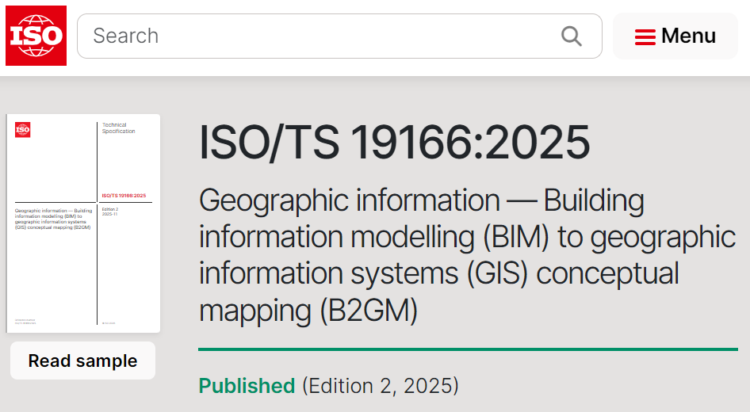
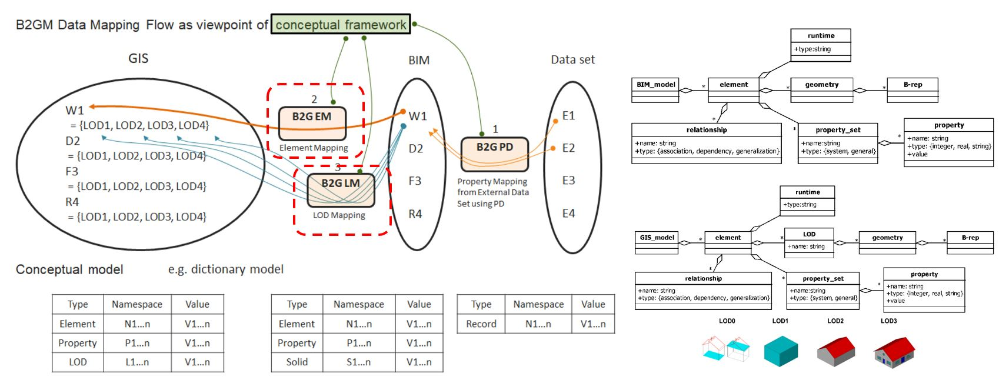
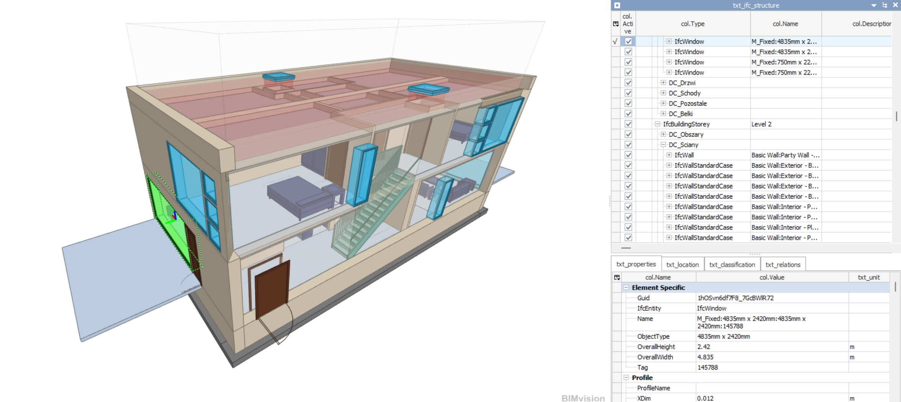
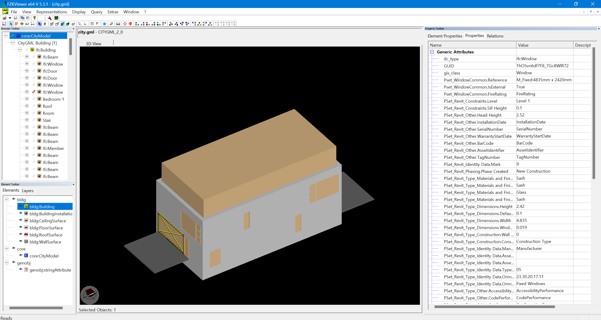
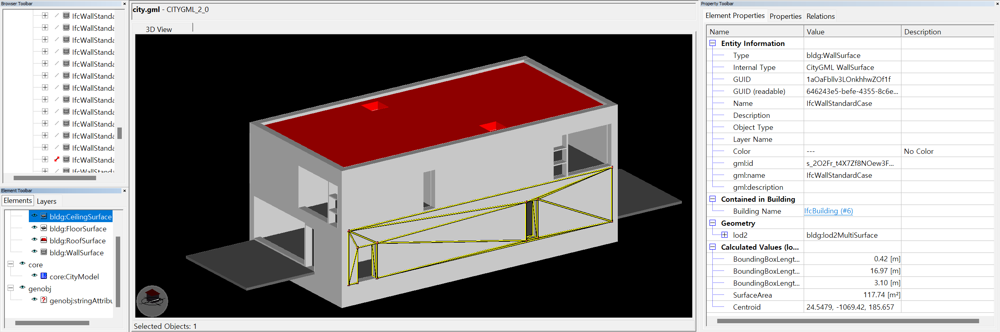
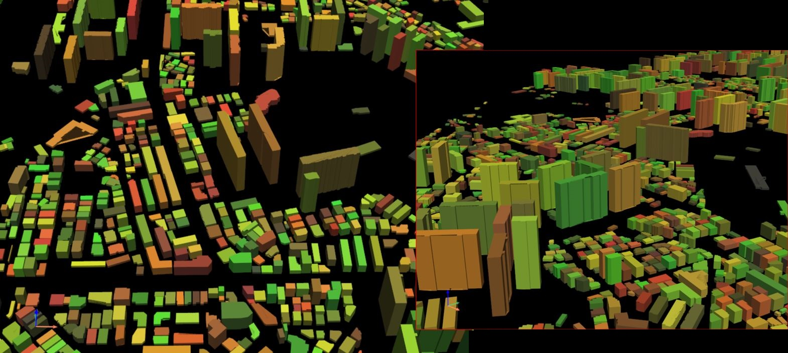

# ISO 19166 B2GM — BIM to GIS conceptual Mapping Tool

Reference implementation by the ISO/TC 211 project leader for ISO/TS 19166.

An implementation of the [ISO/TS 19166 B2GM](https://www.iso.org/standard/90943.html?__cf_chl_f_tk=kQzk7Sv.wtD0SW3l3_Je9LoXWNXBhLEQEXA6Hk0pKfI-1783160263-1.0.1.1-62DOANOnXh6FQ5oxYhj0y2uqeMqNkTNrxb_9_RSg8tY) conceptual framework: mapping a BIM model (IFC) into a GIS model (CityGML) through four well-defined stages. In fact, I thought there were issues with practical application because standards like ISO often only have standard documents without providing tools. Taking this into consideration, I plan to continue updating it whenever I have time. 

<p align="center">
 </img>
</p>

If you are interested in this project, please fork and join.

```
 IFC (BIM)  ──►  PD  ──►  CM  ──►  EM  ──►  LM  ──►  CityGML (GIS)
                 │        │        │        │
        Perspective  Coordinate  Element    LoD
        Definition   Mapping     Mapping    Mapping
```

| Stage | Name                    | Purpose                                                        |
|-------|-------------------------|----------------------------------------------------------------|
| PD    | Perspective Definition  | Select the required subset of the BIM dataset (data/logic/style views) |
| CM    | Coordinate Mapping      | Transform source CRS → destination CRS (e.g. EPSG:4326 → EPSG:3857) |
| EM    | Element Mapping         | Map an IFC class to its GIS/CityGML class (e.g. `IfcBuilding` → `CityModel.Building`) |
| LM    | LoD Mapping             | Assign a GIS Level-of-Detail (LOD0…LOD4)                        |


<p align="center">
 </img>  </br>
 </img>
 </img>  </br>
 </img> </br>
 </img> 
</p>

## Architecture

| Module                    | Role |
|---------------------------|------|
| `B2GM_model.py`           | Common conceptual data model (`element`, `geometry`, `property_set`, `property`, `relationship`, `LOD`, `model`) |
| `B2GM_BIM.py`             | BIM side — parses IFC into B2GM objects (tags each with a stable `ifc_type`) |
| `B2GM_GIS.py`             | GIS side — serialises mapped objects to a **renderable CityGML 2.0** file (geometry + `gml:Envelope`) |
| `B2GM_PD.py`              | PD stage — perspective definition + element selection filters |
| `B2GM_CM.py`              | CM stage — CRS transforms (pyproj), IFC georeference reading (DMS → degrees) and the `Placement` that moves the model into the destination CRS |
| `B2GM_element.py`         | EM stage — element mapping rules (`source` → `destination`, `PSet_operation`) + CLI |
| `B2GM_LM.py`              | LM stage — LoD assignment rules + CLI |
| `B2GM_LM_operators.py`    | **B2G LM operator library** (ISO 19166 Table 8): `footprint`, `OBB`, `projection`, `boundary`, `extrude`, `exterior`, `interior`, `VOID`, `union`, `subtract`, `intersect` — numpy + shapely only |
| `B2GM_main.py`            | Pipeline orchestrator — runs PD → CM → EM → LM with a shared context |
| `B2GM_property.py`        | Property helpers over the conceptual model |
| `B2GM_LM_op_extrude.py`   | Footprint → LOD1 solid extrusion + OBJ/CSV export (config-driven); optional geopandas (read GeoJSON) / pyvista (view) |
| `B2GM_simple_mapping.py`  | Optional: strongly-typed CityGML output via xsdata dataclasses |
| `B2GM_citygml3.py`        | CityGML **3.0** writer — restructured building model (real `bldg:Storey`, `con:fillingSurface` openings, GML 3.2), element names read from `citygml_parser.py` |
| `B2GM_web.py` + `web/`    | Web view — input tree + stage properties, WebGL 3D canvas, output tree (stdlib HTTP server, no extra dependency) |

Optional heavy dependencies (`xsdata`, `geopandas`, `pyvista`, `pydeck`,
`meshio`) are imported lazily; the modules import and the core pipeline runs
without them (a clear error is raised only if an optional feature is invoked).

## ISO 19166 schema conformance

The conceptual classes mirror the ISO 19166 UML structures shipped as XSD
schemas under [`XSD/`](XSD/). Every `xs:complexType` maps to an implementation
class exposing each of its members:

| XSD schema | complexTypes → implementation |
|------------|-------------------------------|
| `B2GM_BIM_model.XSD` / `B2GM_GIS_model.XSD` | `BIM_element`/`GIS_element`, `BIM_model`/`GIS_model`, `property`, `property_set`, `relationship`, `runtime`, `geometry`, `geometry2D`, `geometry3D`, `B-rep`, `LOD` → `B2GM_model.py` |
| `B2GM_EM.XSD` | `EM_rule`, `EM_ruleset`, `EM_source`, `EM_destination` → `B2GM_element.py` |
| `B2GM_LM.XSD` | `LM_rule`, `LM_ruleset` → `B2GM_LM.py`; `OBB`, `vector3D` → `B2GM_LM_operators.py` |
| `B2GM_PD.XSD` | `PD`, `PD_data_view`, `PD_element`, `PD_category`, `PD_property`, `PD_logic_view`, `PD_property_style`, `PD_style_view` → `B2GM_PD.py` |

`tests/test_xsd_conformance.py` parses the XSDs directly and asserts that every
complexType member has a corresponding attribute on its class — so a missing or
renamed member is caught automatically.

### Saving the conceptual models as JSON

`B2GM_BIM.BIM.save()` and `B2GM_GIS.GIS.save()` serialise the parsed/mapped model
to JSON in the exact shape of `B2GM_BIM_model.XSD` / `B2GM_GIS_model.XSD`:

```python
objects = B2GM_BIM.BIM().parse("input_data/duplex_apartment.ifc")
B2GM_BIM.BIM().save("output/bim_model.json", objects)     # {"BIM_model": {"BIM_element": [...]}}

mapped = B2GM_element.apply(objects, rules)
B2GM_GIS.GIS().save("output/gis_model.json", mapped, stage)  # {"GIS_model": {"GIS_element": [...]}}
```

`BIM.load()` / `GIS.load()` read those JSON files back into the internal object
dicts, so a saved model can be re-mapped or re-serialised without touching the
IFC again — `save → load → save` is byte-identical:

```python
objects = B2GM_BIM.BIM().load("output/bim_model.json")     # same shape as parse()
gis_objs = B2GM_GIS.GIS().load("output/gis_model.json")    # restores _destination / _lod / geometry
B2GM_GIS.GIS().store("output/city.gml", gis_objs, {"rule": []})  # re-emit CityGML from JSON
```

A `BIM_element` carries `relationship` / `property_set` / `runtime` / `geometry`
(the element name + GUID become the mandatory *system* `property_set`, and
`geometry` holds the `B-rep` points/faces); a `GIS_element` carries `runtime`
(the mapped GIS class) / `LOD` (name + geometry) / `relationship` /
`property_set`. Run the whole pipeline with `--save-json` to emit both under the
output directory:

The parser also extracts inter-element **relationships** (ISO 19166 BM5/GM5) from
the IFC `IfcRel*` entities, mapping each to a UML relationship type — each record
is `{name, type, related}`:

| IFC relationship | `name` | UML `type` |
|------------------|--------|------------|
| `IfcRelAggregates` | `aggregates` | association |
| `IfcRelContainedInSpatialStructure` | `contains` | association |
| `IfcRelConnectsElements` / `…PathElements` | `connects` | association |
| `IfcRelVoidsElement` | `voids` | association |
| `IfcRelFillsElement` | `fills` | association |
| `IfcRelSpaceBoundary` | `space_boundary` | association |
| `IfcRelAssociatesMaterial` | `material` | dependency |
| `IfcRelDefinesByType` | `type` | generalization |

For `duplex_apartment.ifc` this yields 736 relationships across 166 elements
(association / dependency / generalization), carried through to the GIS model.

```powershell
python B2GM_main.py --save-json     # + output/bim_model.json, output/gis_model.json
```

`tests/test_model_json_save.py` checks the emitted JSON against the XSD members.

## Install

Install as a package (adds the `b2gm` console commands) — from a clone:

```powershell
pip install .            # or: pip install -e .   (editable / development)
```

or straight from GitHub:

```powershell
pip install "git+https://github.com/mac999/ISO19166-B2GM.git"
```

Optional extras: `pip install ".[geo]"` (GeoJSON via geopandas), `".[viz]"`
(pyvista/pydeck 3D viewers), `".[citygml]"` (typed CityGML via xsdata), or
`".[all]"`. Core dependencies (ifcopenshell, pyproj, shapely, numpy, tqdm) are
installed automatically.

Installing exposes four console commands:

| Command | Equivalent module | Purpose |
|---------|-------------------|---------|
| `b2gm` | `B2GM_main` | run the full PD → CM → EM → LM pipeline |
| `b2gm-extrude` | `B2GM_LM_op_extrude` | footprint → LOD1 solid extrusion |
| `b2gm-em` | `B2GM_element` | element-mapping stage (stand-alone) |
| `b2gm-lm` | `B2GM_LM` | LoD-mapping stage (stand-alone) |
| `b2gm-web` | `B2GM_web` | web view (3D canvas + pipeline panels) |

```powershell
b2gm --help
b2gm --input my_building.ifc --pipeline my_pipeline.json --output-dir out
```

The bundled example (`input_data/`) resolves automatically for a repo clone or an
editable install, so a bare `b2gm` runs it; a non-editable install has no bundled
data, so pass `--input`/`--pipeline` explicitly. To build distributables:
`pip install build && python -m build` (produces `dist/*.whl` and `*.tar.gz`).

Or just install the runtime dependencies without packaging:

```powershell
pip install -r requirements.txt
```

## Run

Input data and the pipeline config live under `input_data/`; **all** results
(intermediate + final) are written under `output/`. These are the defaults, so a
bare command runs the shipped example end to end:

```powershell
python B2GM_main.py
```

Equivalent explicit form:

```powershell
python B2GM_main.py --input input_data/duplex_apartment.ifc `
                    --pipeline input_data/B2GM_example.json `
                    --output-dir output
```

`python B2GM_main.py --help` lists every option and shows worked examples.

| Option         | Default                            | Meaning                                            |
|----------------|------------------------------------|----------------------------------------------------|
| `--input`      | `input_data/duplex_apartment.ifc`  | Source IFC (BIM) file                              |
| `--pipeline`   | `input_data/B2GM_example.json`     | Mapping pipeline JSON config                       |
| `--output-dir` | `output`                           | Directory for every intermediate and final result |
| `--output`     | `city.gml`                         | Final CityGML filename (written under `--output-dir`) |

Outputs written to `output/` (filenames come from the pipeline file):

- `intermediate.ifc`      + `intermediate.ifc.pd.json`  — PD perspective (selected elements)
- `intermediate_CM.ifc`   + `intermediate_CM.ifc.cm.json` — CM georeferencing summary (origin, true north, destination CRS, elements placed)
- `city.gml`              — EM result (CityGML 2.0)
- `city_LoD.gml`          — LM result (CityGML 2.0, LoD recorded as a generic
  attribute; where a rule carries an `operation`, the geometry is the operator
  result — the shipped example gives the building a LOD1 block and every room
  its own)

Both are **schema-valid CityGML** — the shipped example validates against the
official OGC schemas at `schemas.opengis.net`, in 2.0 and in 3.0. The BIM parser extracts each
element's triangulated geometry (via ifcopenshell's geometry engine) and the GIS
side writes a `gml:Envelope` plus a properly nested feature tree. IFC type,
GUID, the B2GM LoD name and every property-set value are preserved as
`gen:stringAttribute` generic attributes, so no element is lost.

### Choosing the CityGML version

The output schema is a variable, not a build-time choice:

```powershell
python B2GM_main.py --citygml-version 3.0
```

| Where | How |
|-------|-----|
| CLI | `--citygml-version {2.0,3.0}` on `b2gm`, `b2gm-em`, `b2gm-lm` |
| Pipeline file | `"citygml_version": "3.0"` next to `"BIM_GIS_mapping.pipeline"` |
| Single stage | `"citygml_version": "3.0"` inside an EM or LM stage |

Precedence is CLI, then the stage, then the pipeline file, then `2.0`. Both
versions come out of the same PD/CM/EM/LM result, so only the writer changes.

**CityGML 3.0 removes the storey limitation.** 2.0 has no feature for a building
storey, so `IfcBuildingStorey` can only survive as a generic attribute; 3.0 has
`bldg:Storey`, and the sample's four storeys become real features:

| EM destination | CityGML 2.0 | CityGML 3.0 |
|----------------|-------------|-------------|
| `BuildingStorey` | *(generic attribute only)* | `bldg:buildingSubdivision` → `bldg:Storey` |
| `Room` | `bldg:interiorRoom` → `bldg:Room` (lod4) | `bldg:buildingRoom` → `bldg:BuildingRoom` |
| `Window` / `Door` | `bldg:opening` → `bldg:Window` / `bldg:Door` | `con:fillingSurface` → `con:WindowSurface` / `con:DoorSurface` |
| `WallSurface`, … | `bldg:boundedBy` → `bldg:WallSurface` | `core:boundary` → `con:WallSurface` |
| `LandUse` | `luse:LandUse` (2.0) | `luse:LandUse` (3.0) |
| `BuildingStorey` contents | *(no hierarchy)* | rooms / surfaces / installations nested in their storey |
| geometry | GML 3.1.1, `gml:MultiSurface` | GML 3.2, `gml:Solid` when the mesh closes |

Two further 3.0 differences the writer handles: there is no LOD4 (levels are
clamped to LOD3) and `AbstractSpace` has no `lod1MultiSurface`, so an open mesh
tagged LOD1 is written at LOD2. A closed mesh — which is what the LM `extrude`
operator produces — is written as a `gml:Solid` at its own LoD, checked by
testing that every triangle edge is shared by exactly two faces.

`con:Window` and `con:Door` in 3.0 are *spaces* (physical objects), not the
surfaces filling a wall; the writer maps IFC openings to `con:WindowSurface` /
`con:DoorSurface`, which is what `con:fillingSurface` accepts.

**The IFC spatial hierarchy is preserved.** `IfcRelContainedInSpatialStructure`
records which storey holds each element, and a `bldg:Storey` can carry its own
rooms, installations and boundary surfaces, so the elements are written inside
their storey rather than flat under the building:

```
bldg:Building
  core:boundary            -> surfaces belonging to no storey
  core:lod1Solid           -> the LM block
  bldg:buildingSubdivision -> bldg:Storey "Level 1"
                                core:boundary            21 WallSurface, 10 FloorSurface, 5 CeilingSurface
                                bldg:buildingInstallation 4
                                bldg:buildingRoom        10 BuildingRoom
```

Set `"nest_by_storey": false` in the stage to keep everything flat under the
building instead.

The 3.0 element names, namespaces and child order are read from the CityGML 3.0
XSD bindings in [`citygml_parser.py`](citygml_parser.py) rather than hand-typed.

### CityGML document structure

Each EM destination is placed where the CityGML 2.0 content model expects it:

| EM destination | CityGML property | Feature | Geometry property |
|----------------|------------------|---------|-------------------|
| `CityModel.Building` | `core:cityObjectMember` | `bldg:Building` | `bldg:lod1MultiSurface` (LOD0/1) or `lod2MultiSurface` |
| `WallSurface`, `RoofSurface`, `GroundSurface`, `FloorSurface`, `CeilingSurface`, … | `bldg:boundedBy` | `bldg:WallSurface`, … | `bldg:lod2MultiSurface` (`lod3` when it hosts openings) |
| `Window`, `Door` | `bldg:opening` **of the host surface** | `bldg:Window` / `bldg:Door` | `bldg:lod3MultiSurface` |
| `Room` | `bldg:interiorRoom` | `bldg:Room` | `bldg:lod4MultiSurface` |
| `BuildingInstallation` | `bldg:outerBuildingInstallation` | `bldg:BuildingInstallation` | `bldg:lod2Geometry` |
| `IntBuildingInstallation` | `bldg:interiorBuildingInstallation` | `bldg:IntBuildingInstallation` | `bldg:lod4Geometry` |
| `BuildingPart` | `bldg:consistsOfBuildingPart` | `bldg:BuildingPart` | `bldg:lod2MultiSurface` |
| `LandUse` | `core:cityObjectMember` | `luse:LandUse` | `luse:lod1MultiSurface` |
| `GenericCityObject`, anything unmapped | `core:cityObjectMember` | `gen:GenericCityObject` | `gen:lod1Geometry` |

Windows and doors are attached to the wall they actually sit in: IFC records
`wall -voids-> opening` and `window -fills-> opening`, and the two chain through
the opening's GUID (36 of the 38 openings in the sample resolve; the rest are
written as installations rather than dropped). Because `bldg:opening` is only
allowed from LOD3, a surface that hosts openings is written at
`lod3MultiSurface`.

Children are emitted in the order `AbstractBuildingType` declares — geometry,
`outerBuildingInstallation`, `boundedBy`, `interiorRoom`,
`consistsOfBuildingPart` — since XSD sequences are order-sensitive, and every
`gml:id` is made unique within the document.

> **CityGML 2.0 has no storey feature**, so in 2.0 output `IfcBuildingStorey`
> elements (which carry no geometry) survive only as generic attributes of the
> building. Run with `--citygml-version 3.0` to get real `bldg:Storey` features.

> The geometry is written as `gml:MultiSurface`, not `gml:Solid` — the IFC
> triangulation is not guaranteed to close into a validated solid.

A stage's `output` in the pipeline JSON is treated as a bare filename and
re-rooted at `--output-dir`, so the source tree stays clean.

Each stage is also runnable stand-alone, e.g.:

```powershell
python B2GM_element.py --input input_data/duplex_apartment.ifc --output output/city.gml --option input_data/B2GM_example.json
```

## Pipeline configuration

`B2GM_example.json` defines the stage sequence. A stage carries its `type`
(`PD`/`CM`/`EM`/`LM`), an `output` filename and stage-specific rules:

```json
{ "type": "EM", "output": "city.gml",
  "rule": [{ "source": "IfcBuilding", "destination": "CityModel.Building" }] }
```

`source` / `class` patterns are **full-match** regular expressions, so
`IfcBuilding` does **not** match `IfcBuildingStorey` (use `.*Wall.*` for
substring matching).

### Full-element mapping

The shipped `input_data/B2GM_example.json` maps **every** element of the input
IFC to an appropriate CityGML feature — not just the building. Its PD `data_view`
selects all classes (`class: ".*"`) so nothing is dropped before element
mapping, and the EM stage carries one rule per IFC type, evaluated top-down
(**first full-match wins**) with a trailing `.*` catch-all so no element is ever
lost.

The BIM parser also exposes each element's IFC `PredefinedType`, so a rule can
**refine a type by its predefined kind** using a compound source
`<ifc_type>.<PredefinedType>` (e.g. `IfcSlab\.ROOF`); a plain `IfcSlab` rule
still matches every slab, and the ordering (specific before generic) resolves
the rest:

| IFC type (source) | CityGML feature |
|-------------------|-----------------|
| `IfcBuilding` | `CityModel.Building` |
| `IfcBuildingStorey` | `BuildingStorey` |
| `IfcSpace` | `Room` |
| `IfcWall`, `IfcWallStandardCase` (`IfcWall.*`) | `WallSurface` |
| `IfcSlab\.ROOF` | `RoofSurface` |
| `IfcSlab\.FLOOR`, `IfcSlab\.LANDING`, `IfcSlab` *(generic)* | `FloorSurface` |
| `IfcSlab\.BASESLAB` | `GroundSurface` |
| `IfcWindow` | `Window` |
| `IfcDoor` | `Door` |
| `IfcCovering\.CEILING` | `CeilingSurface` |
| `IfcCovering\.FLOORING` | `FloorSurface` |
| `IfcCovering`, `IfcBeam`, `IfcColumn`, `IfcMember`, `IfcRailing`, `IfcStair` | `BuildingInstallation` |
| `IfcSite` | `LandUse` |
| *(any other)* `.*` | `GenericCityObject` |

For the sample `duplex_apartment.ifc` this maps all **174** elements: 57
`WallSurface`, 24 `Window`, 21 `Room`, 20 `FloorSurface`, 18
`BuildingInstallation`, 14 `Door`, 13 `CeilingSurface`, 4 `BuildingStorey`, 1
`RoofSurface`, 1 `LandUse`, 1 `CityModel.Building` — the 21 slabs correctly
split into 20 floors + 1 roof, and the 13 ceiling coverings into
`CeilingSurface`.

## Coordinate mapping and georeferencing

The CM stage reads the IFC georeferencing (`IfcSite.RefLatitude` /
`RefLongitude` / `RefElevation` and the context `TrueNorth`) and **rewrites every
element's coordinates into the destination CRS**, so the emitted CityGML is
georeferenced rather than sitting at the project origin:

```json
{ "type": "CM", "output": "intermediate_CM.ifc",
  "rule": [
    { "source": "EPSG:4326", "destination": "EPSG:3857" },
    { "transform_matrix": [[1,0,0,0],[0,1,0,0],[0,0,1,0],[0,0,0,1]] }
  ] }
```

The placement chain is: the stage's 4×4 `transform_matrix`, then the true-north
rotation (IFC `+Y` is project north), then a transverse-Mercator CRS centred on
the site origin — which makes the IFC's local metres directly usable as
projected coordinates — and finally pyproj into `destination`. Any CRS pyproj
knows works, so `EPSG:3857`, a UTM zone or a national grid such as `EPSG:5186`
are all valid destinations.

| Stage key | Meaning |
|-----------|---------|
| `rule[].source` / `.destination` | source (IFC georeference) and destination CRS |
| `rule[].transform_matrix` | 4×4 placement applied in local coordinates first |
| `rule[].origin` | `{"lon":…, "lat":…, "elevation":…}` — origin for an IFC with no `IfcSite` georeferencing |
| `georeference` | set to `false` to keep the model in local coordinates |

The destination CRS is written as `srsName` on the `gml:Envelope` and on every
`gml:MultiSurface`. Without georeferencing (no `IfcSite` data and no `origin`
override) the stage logs a warning, leaves the coordinates local and omits
`srsName` — the file is still valid CityGML, just not placed.

For the shipped `duplex_apartment.ifc` the result lands at lon −87.6394 /
lat 41.8744 (Chicago) with its ground footprint preserved: the 8.85 × 26.57 m
local model becomes an 11.87 × 35.76 m envelope in EPSG:3857, which is the
expected Web Mercator inflation of 1/cos(41.87°) = 1.343.

## Perspective Definition views

The PD stage runs all three ISO 19166 views, not just the data filter.

**`data_view`** selects elements by class and property filter (regex).

**`logic_view`** joins external data into the perspective. `external_data_source`
is a JSON (`{GUID: {...}}` or a list of records with a `GUID` key) or CSV file
with a `GUID` column; without an `ETL_module` the records are joined onto the
matching elements as a `PD_logic` property set. An `ETL_module` is
`"module:function"`, imported and called as `fn(objects, source)`:

```json
{ "type": "PD",
  "logic_view": { "external_data_source": "input_data/PD_logic_source.json",
                  "ETL_module": "" } }
```

**`style_view`** picks the classes whose properties are styled;
`property_style` carries the `PD_property_style` rules that do the formatting.
`category` and `property` are regex, and `formattingOperation` is a `|`-separated
chain:

```json
{ "type": "PD",
  "style_view": [{ "class": ".*" }],
  "property_style": [
    { "category": "PSet_Revit_Dimensions", "property": "Length|Area|Volume",
      "formattingOperation": "round:3" },
    { "category": "Pset_.*Common", "property": "Reference",
      "formattingOperation": "strip|upper" }
  ] }
```

| `formattingOperation` | Effect |
|-----------------------|--------|
| `upper` / `lower` / `title` / `strip` | string case and whitespace |
| `round:N` | round a number to N digits (`round:0` yields an int) |
| `scale:F` | multiply a number by F |
| `prefix:TEXT` / `suffix:TEXT` | wrap the value |
| `replace:OLD:NEW` | substring replacement |
| `format:SPEC` | Python `str.format` spec, e.g. `format:{:.1f} m` |
| `truncate:N` | keep the first N characters |

After `select()` the schema-conformant `PD_data_view` holds one `PD_element` per
selected element, carrying its `objectGUID` and its `PD_category` groups (one per
property set).

## EM property-set operation

`EM_rule.PSet_operation` (ISO 19166 Table 5) decides what reaches the GIS
element when a rule defines its own `property_set`:

```json
{ "source": "IfcBuilding", "destination": "CityModel.Building",
  "PSet_operation": "Append",
  "property_set": { "B2GM": { "source_standard": "ISO 19166 B2GM" } } }
```

| Value | Result |
|-------|--------|
| `Append` (default) | the rule's `property_set` plus the source IFC property sets |
| `Replace` | the source IFC property sets only — the rule's set is dropped |

The chosen sets are what the CityGML `gen:stringAttribute` list is built from.

## B2G LM geometry operators

`B2GM_LM_operators.py` is a general, dataset-agnostic implementation of the LOD
mapping operators defined in ISO 19166 (Table 8). All eleven operators of the
UML `LM_rule` are implemented and reachable from the pipeline config. Geometry
is represented with `shapely` polygons (2D) and a lightweight `Solid` (vertices
+ faces B-rep, 3D); only `numpy` and `shapely` are required.

| Operator | Signature (UML) | Notes |
|----------|-----------------|-------|
| `footprint` | `footprint(el)` | projection onto XY |
| `OBB` | `OBB(el)` | principal-component oriented box |
| `projection` | `projection(g, base)` | `base` in `XY/XZ/YZ` (and the reversed `YX/ZX/ZY` spellings) |
| `boundary` | `boundary(g, base)` | outline of the projected area |
| `extrude` | `extrude(g, v, height)` | plus `base_z`; MultiPolygon input yields one merged solid |
| `exterior` / `interior` | `exterior(g)` / `interior(g)` | outer shell / inner shells |
| `VOID` | `VOID(e)` | window/door/opening sub-elements |
| `union` / `subtract` / `intersect` | `union(g1, g2)` … | 2D via shapely; 3D via `trimesh` when installed, otherwise on vertical prisms (the LOD1 case) |

```python
from shapely.geometry import Polygon
import B2GM_LM_operators as OP

footprint = Polygon([(0, 0), (10, 0), (10, 20), (0, 20)])
block = OP.extrude(footprint, (0, 0, 1), height=12.0)   # LOD1 block model
block.save_obj("building.obj")                           # no pyvista/meshio needed

OP.footprint(block).area        # 200.0  (projection onto XY)
OP.projection(block, "XZ").area # 120.0  (elevation)
OP.obb(block).extent            # (20.0, 12.0, 10.0)  oriented bounding box
OP.union(a2d, b2d)              # 2D boolean set operators
OP.void(wall_element)           # window/door/opening sub-elements
```

Operators accept the flat `{'verts': [...], 'faces': [...]}` B-rep the IFC
parser attaches to every element, a `Solid`, or a shapely geometry;
`OP.from_brep()` / `OP.to_brep()` convert between the two.

### Driving the operators from the pipeline

An `LM_rule` may carry an `operation`: a chain of operators applied to the
matched element. The first step receives the element, each later step the
previous result, and the final geometry replaces the element's own in the
CityGML output:

```json
{ "type": "LM", "output": "city_LoD.gml",
  "rule": [
    { "source": "IfcBuilding", "lod": "LOD1",
      "aggregate": "IfcWall.*|IfcSlab|IfcCovering",
      "operation": [
        { "op": "footprint" },
        { "op": "extrude",
          "args": { "v": [0, 0, 1], "height": {"$extent": "z"}, "base_z": {"$min": "z"} } }
      ] },
    { "source": "IfcSlab\\.ROOF", "lod": "LOD0", "operation": [{"op": "footprint"}] },
    { "source": ".*", "lod": "LOD2" }
  ] }
```

| Rule key | Meaning |
|----------|---------|
| `operation` | operator chain (`{"op": name, "args": {...}}`; a bare string is the operator name) |
| `aggregate` | regex over IFC types — run the chain on the merged geometry of every match instead of the element's own. An `IfcBuilding` carries no geometry, so its LOD1 block comes from its walls and slabs |

Argument values may reference the element instead of being literals:

| Reference | Resolves to |
|-----------|-------------|
| `{"$property": "Pset.Name"}` | a property-set value (coerced to float when possible) |
| `{"$extent": "z"}` | the element's bounding-box size along an axis |
| `{"$min": "z"}` / `{"$max": "z"}` | the low / high bound along an axis |

A failing chain is logged and the element keeps its source geometry, so one bad
rule never aborts the run.

A 2D result (`footprint`, `projection`, a boolean) carries no elevation, so it is
placed at the source element's own base rather than dropping to `z = 0` — a
`LOD0` roof footprint stays at roof height.

Pick the `aggregate` pattern to match the envelope you want: the shipped example
uses `IfcWall.*` rather than also taking `IfcSlab`, because the sample's entrance
terraces are slabs reaching 6 m beyond each end of the building and would stretch
the LOD1 block from 23.96 m to 35.76 m.

Footprint extrusion for whole cities (GeoJSON in, OBJ/CSV out) is driven entirely
by the config file — footprint attribute names, storey height, base offset,
CRS transform and per-building colouring are all parameters, nothing is
hard-coded. It follows the same convention as the main pipeline: the config
lives under `input_data/` and results are written under `output/`, so a bare
command runs the shipped example (`input_data/GY_PICK_20240603a.geojson` →
`output/lod1_buildings/`):

```powershell
python B2GM_LM_op_extrude.py                                              # extrude + export
python B2GM_LM_op_extrude.py --config input_data/LoD1_mapping_example.json
python B2GM_LM_op_extrude.py --show                                       # + 3D viewer (pyvista)
```

`python B2GM_LM_op_extrude.py --help` documents every config key. GeoJSON is read
with `geopandas` when installed, otherwise via the stdlib `json` reader plus
`shapely` (both already required), so the example runs without any optional
dependency.

## Web view

```powershell
python B2GM_main.py --web          # or: python B2GM_web.py / b2gm-web
```

Opens a three panel workspace at `http://127.0.0.1:8000` on the stdlib HTTP
server — no web framework, no CDN, nothing to install beyond the core
dependencies.

| Panel | Contents |
|-------|----------|
| Left | input folder tree, and the PD/CM/EM/LM stage properties read from the pipeline JSON (collapsible per stage) |
| Middle | WebGL canvas — drag to orbit, wheel to zoom, right drag to pan; a legend lists the CityGML feature classes with counts and toggles each on or off |
| Right | output folder tree plus a text preview of the selected file |

Both side panels are resized by dragging the splitters (the widths are
remembered). **Run pipeline** executes PD → CM → EM → LM on the IFC selected in
the input tree and streams the stage log back, then reloads the output tree and
the canvas.

`.gml` (CityGML), `.json` (`bim_model.json` / `gis_model.json`) and `.obj` files
render in the canvas; everything else opens in the preview pane.

The theme (dark / light) and language (English / 한국어) toggles are in the
header and persist. Both can also be set from the URL, which makes a view
shareable: `?theme=light&lang=ko&hide=WallSurface,CityModel.Building`.

| Option | Default | Meaning |
|--------|---------|---------|
| `--port` | `8000` | listening port |
| `--host` | `127.0.0.1` | bind address |
| `--no-browser` | off | do not open a browser window |
| `--input-dir` / `--output-dir` / `--pipeline` | `input_data` / `output` / `input_data/B2GM_example.json` | workspace roots (`B2GM_web.py` only; `--web` reuses the pipeline options) |

File access is confined to the two workspace roots — a path that escapes them is
refused.

## Tests

```powershell
python -m pytest
```

The suite (`tests/`) covers the conceptual model, PD filtering / logic view /
style formatting, CM coordinate transforms, EM rule matching and
`PSet_operation`, the LM operator chains, GIS XML serialisation, IFC parsing,
the web view (readers, routes, path confinement), the CityGML 2.0 and 3.0
document structure (feature nesting, LoD, element order, version selection) and
the full end-to-end pipeline. Tests that need the sample IFC or optional
dependencies are skipped automatically when those are unavailable.

# Author
Taewook kang, Ph.D, laputa99999@gmail.com

Project leader, ISO/TC 211 ISO/TS 19166
